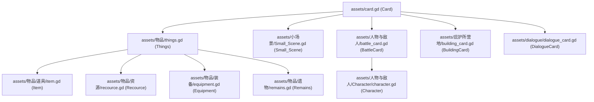
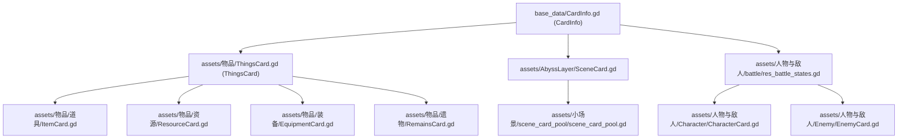
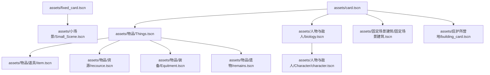

# 09 Card Inheritance And Feature Deltas

Use this file when the request is:
- "card inheritance relation"
- "which scene adds/removes what"
- "show architecture as diagram"

## 1) Script Inheritance Chain (Card Scene Scripts)

## 2) Resource Inheritance Chain (Card Data Resources)

## 3) Scene Instancing Chain (.tscn)

Notes:
- `assets/fixed_card.tscn` is standalone at the scene-instancing level; it does not instance `assets/card.tscn`.
- `assets/fixed_card.tscn` still reuses card behavior through an inline script that extends `assets/card.gd`.
- `assets/人物与敌人/Enemy/enemy.tscn` is standalone (not instanced from `card.tscn`).
- `assets/dialogue/dialogue_card.tscn` is standalone (not instanced from `card.tscn`).

## 4) Feature Delta Matrix (Relative to Parent Scene)

### Base
- `assets/card.tscn`
  - Provides full baseline: drag/stack detect area, state machine, SubViewport card rendering, shadow/surface handling, animation player, shooter node.
- `assets/fixed_card.tscn`
  - Standalone scene root, not a child scene of `assets/card.tscn`.
  - Reuses core `Card` behavior through an inline script extending `assets/card.gd`.
  - Provides a simplified fixed-card composition.

### Things Line
- `assets/物品/Things.tscn` (parent: `assets/card.tscn`)
  - Added: `ValueLabel`, value text UI, `CardProgressBar`.
- `assets/物品/道具/item.tscn` (parent: `assets/物品/Things.tscn`)
  - Added: style/theme overrides for item visual type.
  - Removed: no extra system removal; keeps Things behavior.
- `assets/物品/资源/recource.tscn` (parent: `assets/物品/Things.tscn`)
  - Added: `FoodLabel` (nutrition display).
  - Reduced/hidden: `CardLabel`, `CardStackDetectorArea` default hidden in scene config.
- `assets/物品/装备/Equitment.tscn` (parent: `assets/物品/Things.tscn`)
  - Added: `EffectLabel` (equipment effect display).
  - Reduced/hidden: `CardLabel`, `CardStackDetectorArea` default hidden in scene config.
- `assets/物品/遗物/remains.tscn` (parent: `assets/物品/Things.tscn`)
  - Added: `LevelLabel` (rarity/grade display).
  - Reduced/hidden: `CardLabel`, `CardStackDetectorArea` default hidden in scene config.

### Abyss/Small Scene Line
- `assets/小场景/Small_Scene.tscn` (parent: `assets/fixed_card.tscn`)
  - Added: `CardProgressBar`, state machine nodes back for fixed + instack path.
  - Added script logic from the removed abyss scene layer: `set_stats`, timer spawn, stack-driven speed updates.
  - Added small-scene-specific behavior: cumulative speed calculation + spawn pick strategy.

### Battle Line
- `assets/人物与敌人/biology.tscn` (parent: `assets/card.tscn`)
  - Added: `AttributeLabels` (HP/ATK/DEF panel), battle-style rendering setup.
- `assets/人物与敌人/Character/character.tscn` (parent: `assets/人物与敌人/biology.tscn`)
  - Added: `BattleStartArea`, bag button, character-specific battle/feature wiring.

### Other Card Variants
- `assets/固定场景建筑/固定场景建筑.tscn` (parent: `assets/card.tscn`)
  - Added: building card style/label variant.
  - Script: uses `assets/庇护所营地/building_card.gd`.
  - Reduced/hidden: `CardLabel`, `CardStackDetectorArea` default hidden in scene config.
- `assets/庇护所营地/building_card.tscn` (parent: `assets/card.tscn`)
  - Added: building card variant for camp flow.
  - Script: uses `assets/庇护所营地/building_card.gd`.
- `assets/人物与敌人/Enemy/enemy.tscn` (standalone)
  - Added: dedicated enemy panel + battle labels; does not reuse base card state machine chain.
- `assets/dialogue/dialogue_card.tscn` (standalone)
  - Added: dialogue text content layout (`ContentLabel`) and click button surface.
  - Reduced: no base card drag/stack/state-machine structure.

## 5) Fast Answer Template

When user asks "inheritance and feature differences", answer in this order:
1. Script inheritance graph.
2. Resource inheritance graph.
3. Scene instancing graph.
4. Parent-relative feature delta bullets.
